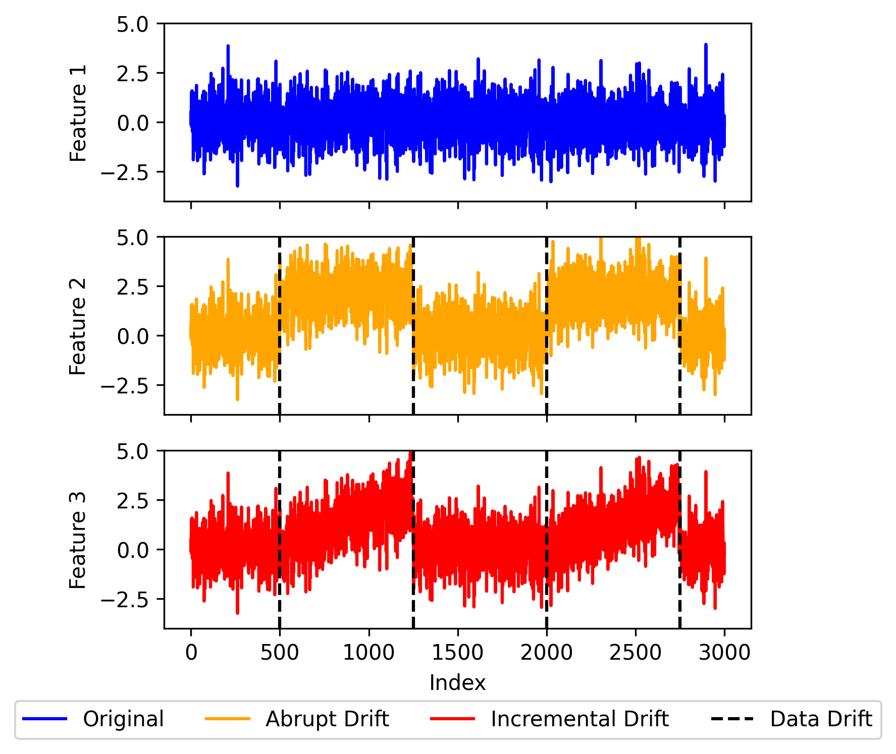
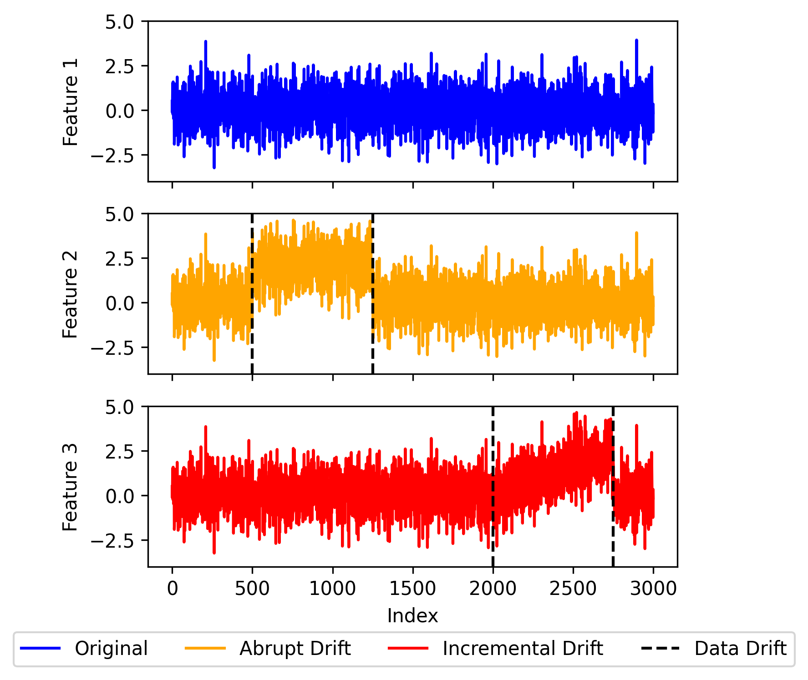

# Synthetic Datasets Documentation

## Abstract

This document presents the comprehensive specification of synthetic datasets employed in the empirical analysis of data drift detection techniques. The synthetic datasets are systematically generated using scikit-learn's `make_classification` function and subsequently modified with controlled drift patterns to provide ground truth conditions for evaluating drift detection algorithms under known experimental parameters.

## 1. Theoretical Foundation and Drift Scenario Design

### 1.1 Conceptual Framework

The design of synthetic drift scenarios is grounded in two fundamental drift patterns that represent distinct modes of concept drift occurrence in streaming data environments. These conceptual frameworks are illustrated in the foundational diagrams below:

#### Parallel Drift Concept


#### Switching Drift Concept  


These diagrams illustrate the theoretical foundation that guided the implementation of the synthetic dataset generation methodology.

### 1.2 Drift Pattern Taxonomy

#### 1.2.1 Parallel Drift Pattern
The parallel drift pattern represents scenarios where multiple data features experience simultaneous distributional changes. This pattern models real-world situations where system-wide changes affect multiple variables concurrently, such as environmental shifts affecting multiple sensor readings or market conditions influencing multiple financial indicators simultaneously.

**Theoretical Characteristics:**
- Simultaneous onset across multiple features
- Synchronized drift timing
- Correlated distributional changes
- High-dimensional drift detection challenges

#### 1.2.2 Switching Drift Pattern  
The switching drift pattern models sequential distributional changes where features experience drift in temporal succession. This pattern represents scenarios where changes propagate through system components sequentially, such as cascading failures in network systems or progressive degradation in manufacturing processes.

**Theoretical Characteristics:**
- Sequential onset across features
- Temporal drift propagation
- Independent feature-level changes
- Multi-stage drift detection requirements

### 1.3 Implementation Rationale

The conceptual frameworks illustrated in the foundational diagrams informed the specific parameter selections and algorithmic implementations employed in the synthetic dataset generation process. The translation from theoretical concepts to computational implementation ensures that the generated datasets maintain the essential characteristics of each drift pattern while providing controlled experimental conditions for algorithm evaluation.

## 2. Base Dataset Generation Methodology

### 2.1 Data Source and Generation Framework
The synthetic datasets are generated using the `sklearn.datasets.make_classification` function, which provides a robust foundation for creating realistic synthetic classification datasets with controlled statistical characteristics suitable for empirical analysis.

### 2.2 Base Configuration Parameters
```python
n_samples = 80000          # Total dataset size
n_features = 5             # Number of input features (feature1 through feature5)
n_informative = 4          # Number of informative features
n_redundant = 1            # Number of redundant features
n_classes = 2              # Binary classification
random_state = 42          # Fixed seed for reproducibility
```

### 2.3 Data Preprocessing and Standardization
The generated datasets undergo standardized preprocessing to ensure consistency across experimental conditions:

- **Value Transformation**: Feature values are normalized to positive ranges through additive transformation: `X_positive = X - np.min(X) + 1`
- **Feature Nomenclature**: Systematic naming convention employing `feature1` through `feature5` identifiers
- **Target Variable**: Binary classification labels (0, 1) maintained in dedicated `class` column

## 3. Drift Configuration and Experimental Design

### 3.1 Feature Selection for Drift Application
The experimental design employs a controlled approach where drift modifications are applied to a subset of features while maintaining control variables:

**Features Subject to Drift Modification:**
- `feature1`
- `feature3` 
- `feature5`

**Control Features (Unmodified):**
- `feature2`
- `feature4`

This configuration enables the evaluation of drift detection algorithms' ability to distinguish between genuine distributional changes and natural data variation, while providing internal controls for false positive assessment.

### 3.2 Drift Parameter Specification

The experimental framework employs two distinct drift types, each characterized by specific mathematical transformations and temporal patterns:

#### 3.2.1 Abrupt Drift Implementation
- **Drift Type**: Instantaneous distributional shift
- **Implementation Function**: `add_abrupt_drift()`
- **Magnitude**: Additive constant of +5.0 applied to all values within drift window
- **Mathematical Transformation**: `feature_value_new = feature_value_original + 5.0`

#### 3.2.2 Incremental Drift Implementation
- **Drift Type**: Progressive distributional change
- **Implementation Function**: `add_incremental_drift()`
- **Initial Magnitude**: 0.05
- **Step Increment**: 0.001 per sample
- **Mathematical Transformation**: 
  ```
  for i in range(start_index, end_index):
      feature_value[i] += change
      change += 0.001
  ```

### 3.3 Temporal Configuration Parameters
The drift timing configuration ensures systematic and reproducible experimental conditions:

- **Drift Event Frequency**: 2 occurrences per affected feature
- **Drift Initiation**: Positioned after 2 batch processing cycles (`min_index = 2 * batch_size`)
- **Total Drift Duration**: 20,000 samples (distributed across drift events)
- **Batch Alignment**: Complete alignment within batch boundaries (`drift_within_batch = 1.0`)

### 3.4 Batch Processing Window Specifications
The experimental design evaluates algorithm performance across multiple batch processing configurations:

- 1000 samples per batch
- 1500 samples per batch  
- 2000 samples per batch
- 2500 samples per batch

## 4. Synthetic Dataset Scenario Specifications

### 4.1 Control Dataset (No Drift Baseline)
- **Dataset Identifier**: `synthetic_dataset_no_drifts`
- **Experimental Purpose**: Baseline condition without artificial drift modifications
- **Feature Modifications**: None applied
- **Research Application**: Control condition for false positive rate assessment

### 4.2 Parallel Abrupt Drift Scenario
- **Dataset Identifier**: `synthetic_dataset_with_parallel_drifts_abrupt`
- **Experimental Design**: Simultaneous abrupt drift across multiple features
- **Drift Characteristics**: 
  - Synchronized drift application to features 1, 3, and 5
  - Two discrete drift events occurring in parallel across all affected features
- **Implementation Code**: `"parallel_abrupt"`

### 4.3 Parallel Incremental Drift Scenario
- **Dataset Identifier**: `synthetic_dataset_with_parallel_drifts_incremental`
- **Experimental Design**: Simultaneous incremental drift across multiple features
- **Drift Characteristics**:
  - Progressive drift application to features 1, 3, and 5 during identical time periods
  - Two incremental drift sequences occurring in parallel
- **Implementation Code**: `"parallel_incremental"`

### 4.4 Switching Abrupt Drift Scenario
- **Dataset Identifier**: `synthetic_dataset_with_switching_drifts_abrupt`
- **Experimental Design**: Sequential abrupt drift across individual features
- **Drift Characteristics**:
  - Individual feature drift application in temporal succession
  - Total of six discrete drift events (two per feature, applied sequentially)
- **Implementation Code**: `"switching_abrupt"`

### 4.5 Switching Incremental Drift Scenario
- **Dataset Identifier**: `synthetic_dataset_with_switching_drifts_incremental`
- **Experimental Design**: Sequential incremental drift across individual features
- **Drift Characteristics**:
  - Progressive drift application to individual features in temporal succession
  - Six incremental drift sequences (two per feature, applied sequentially)
- **Implementation Code**: `"switching_incremental"`

## 5. Drift Point Calculation Algorithms

### Parallel Drift Scenario
```python
drift_length = total_drift_length / (num_drifts * len(features_with_drifts))
spacing = (index_space_size - num_drifts * drift_length) // num_drifts

# All features drift at the same time points
for i in range(num_drifts):
    start_index = min_index + i * (drift_length + spacing)
    end_index = start_index + drift_length
    # Apply to all features simultaneously
```

### Switching Drift Scenario  
```python
drift_length = total_drift_length / (num_drifts * len(features_with_drifts))
spacing = available_space // (num_drifts * len(features_with_drifts))

# Features drift sequentially
for i in range(num_drifts):  # Drift sequences
    for j, feature in enumerate(features_with_drifts):  # Features
        start_index = min_index + i * (len(features) * (drift_length + spacing)) + j * (drift_length + spacing)
        end_index = start_index + drift_length
        # Apply to one feature at a time
```

## Generated Visualizations

The framework automatically generates comprehensive visualizations for each synthetic dataset, providing visual confirmation of drift patterns and timing.

### Feature Plots Directory Structure
```
comparison_results/
├── synthetic_dataset_with_parallel_drifts_abrupt/
│   └── feature_plots/
├── synthetic_dataset_with_parallel_drifts_incremental/
│   └── feature_plots/
├── synthetic_dataset_with_switching_drifts_abrupt/
│   └── feature_plots/
├── synthetic_dataset_with_switching_drifts_incremental/
│   └── feature_plots/
└── synthetic_dataset_no_drifts/
    └── feature_plots/
```

### Plot Types Generated

#### 1. Original Feature Distributions
- **Filename Pattern**: `{dataset}_feature{1-5}.png`
- **Content**: Clean feature data without drift modifications
- **Purpose**: Baseline visualization for comparison

#### 2. Features with Drift Overlay
- **Filename Pattern**: `{dataset}_feature{1-5}_{scenario}_drifts_{batch_size}_1.0.png`
- **Content**: Feature data with drift regions highlighted
- **Purpose**: Visual identification of drift timing and magnitude

#### 3. Features with Drift and Batch Boundaries
- **Filename Pattern**: `{dataset}_feature{1-5}_{scenario}_drifts_and_batches_{batch_size}_1.0.png`
- **Content**: Feature data with both drift regions and batch processing boundaries
- **Purpose**: Understanding drift alignment with batch processing windows

#### 4. All Features Combined View
- **Filename Pattern**: `{dataset}_all_features_{scenario}_drifts_{batch_size}_1.0.png`
- **Content**: All 5 features plotted together showing drift patterns
- **Purpose**: Comprehensive view of parallel vs switching drift behavior

#### 5. Feature Variation Analysis
- **Filename Pattern**: `{dataset}_feature1_{scenario}_drifts_{batch_size}__variations.png`
- **Content**: Detailed analysis of drift variations for feature1
- **Purpose**: In-depth examination of drift characteristics

### Visual Examples by Scenario

#### Parallel Abrupt Drift Visualization
**Dataset**: `synthetic_dataset_with_parallel_drifts_abrupt`

Key plots for batch size 1000:
- **All Features Overview**: 
  `synthetic_dataset_with_parallel_drifts_abrupt_all_features_parallel_abrupt_drifts_1000_1.0.png`
  - Shows features 1, 3, and 5 experiencing simultaneous abrupt changes
  - Features 2 and 4 remain stable (control features)

- **Individual Feature Analysis**:
  `synthetic_dataset_with_parallel_drifts_abrupt_feature1_parallel_abrupt_drifts_1000_1.0.png`
  - Demonstrates the +5.0 sudden shift in feature1 values
  - Clear step-function pattern at drift points

#### Switching Incremental Drift Visualization  
**Dataset**: `synthetic_dataset_with_switching_drifts_incremental`

Key plots for batch size 1000:
- **Sequential Drift Pattern**:
  `synthetic_dataset_with_switching_drifts_incremental_all_features_switching_incremental_drifts_1000_1.0.png`
  - Shows features drifting one after another in sequence
  - Gradual slope changes rather than abrupt steps

#### Control Dataset Visualization
**Dataset**: `synthetic_dataset_no_drifts`

- **Stable Baseline**: 
  `synthetic_dataset_no_drifts_all_features.png`
  - All features maintain consistent distributions
  - No artificial drift patterns introduced

### Plot Interpretation Guide

#### Visual Indicators
- **Drift Regions**: Highlighted areas showing where artificial drift is applied
- **Batch Boundaries**: Vertical lines indicating processing window divisions
- **Feature Stability**: Unchanged features (2 and 4) provide visual reference
- **Drift Magnitude**: Y-axis scale shows the +5.0 shift for abrupt drift
- **Drift Progression**: Incremental drift shows gradual slope changes

#### Color Coding
- **Original Data**: Typically shown in blue
- **Drift Regions**: Highlighted with contrasting colors
- **Batch Boundaries**: Vertical dashed lines
- **Multiple Features**: Different colors per feature for clarity

### Accessing the Plots

All visualization files are stored in the respective dataset directories:
```bash
# Example paths for parallel abrupt drift scenario
comparison_results/synthetic_dataset_with_parallel_drifts_abrupt/feature_plots/
├── synthetic_dataset_with_parallel_drifts_abrupt_all_features.png
├── synthetic_dataset_with_parallel_drifts_abrupt_all_features_parallel_abrupt_drifts_1000_1.0.png
├── synthetic_dataset_with_parallel_drifts_abrupt_feature1_parallel_abrupt_drifts_1000_1.0.png
├── synthetic_dataset_with_parallel_drifts_abrupt_feature3_parallel_abrupt_drifts_1000_1.0.png
└── synthetic_dataset_with_parallel_drifts_abrupt_feature5_parallel_abrupt_drifts_1000_1.0.png
```

These plots serve as visual validation of the synthetic drift generation process and provide clear documentation of the experimental conditions for research reproducibility.

## Dataset Files

### CSV Output
Each generated dataset is saved as:
- **Location**: `comparison_results/{dataset_name}/{dataset_name}.csv`
- **Format**: CSV with feature columns (feature1-feature5) and class column
- **Size**: 80,000 rows × 6 columns

### Drift Analysis Files
- **Location**: `comparison_results/{dataset_name}/drift_files/`
- **File**: `drift_analysis_{batch_size}_1.0.json`
- **Content**: Synthetic drift points and detected drift points for comparison

## Implementation Details

### Key Functions
1. **`create_synthetic_dataframe()`**: Base dataset generation using sklearn
2. **`determine_drift_points()`**: Calculate drift timing based on scenario
3. **`apply_drifts_to_dataframe()`**: Apply drift modifications to features
4. **`add_abrupt_drift()`**: Implement sudden drift changes
5. **`add_incremental_drift()`**: Implement gradual drift changes

### Execution Flow
```python
# From comparisor.py run_full_experiment()
dataframe_size = 80000
features_with_drifts = ["feature1", "feature3", "feature5"]
batch_sizes = [1000, 1500, 2000, 2500]

for dataset in synthetic_datasets:
    for batch_size in batch_sizes:
        # Generate synthetic dataset with specified drift pattern
        synthetic_df, drift_points, drift_info, accumulated_differences, features = 
            generate_synthetic_dataset_with_drifts(
                dataframe_size=dataframe_size,
                features_with_drifts=features_with_drifts,
                batch_size=batch_size,
                scenario=scenario,
                num_drifts=2
            )
```

## Reproducibility

### Fixed Parameters
- **Random Seed**: 42 (set in multiple locations)
- **NumPy Seed**: `np.random.seed(42)`
- **Sklearn Random State**: `random_state=42`

### Version Dependencies
- **scikit-learn**: For `make_classification`
- **NumPy**: For array operations and random number generation
- **Pandas**: For DataFrame operations

## Usage in Experiments

These synthetic datasets serve as ground truth for evaluating drift detection algorithms:

1. **Known Drift Points**: Exact locations and types of drift are recorded
2. **Controlled Conditions**: Systematic variation of drift patterns
3. **Multiple Scenarios**: Comprehensive coverage of drift types
4. **Batch Size Analysis**: Evaluation across different processing window sizes
5. **Algorithm Comparison**: Consistent baseline for comparing HDDDM, KSDDM, and JSDDM

The synthetic datasets enable precise evaluation of drift detection performance under controlled conditions where the true drift characteristics are known, complementing the real-world datasets used in the empirical analysis.

## Quick Reference Summary

### Dataset Configuration Table

| Parameter | Value | Description |
|-----------|-------|-------------|
| **Dataset Size** | 80,000 samples | Total number of data points per dataset |
| **Features** | 5 (feature1-feature5) | Number of input features |
| **Features with Drift** | 3 (feature1, feature3, feature5) | Features modified with drift patterns |
| **Control Features** | 2 (feature2, feature4) | Features without drift modifications |
| **Classes** | 2 (binary: 0, 1) | Classification target |
| **Drift Events** | 2 per affected feature | Number of drift occurrences |
| **Batch Sizes** | 1000, 1500, 2000, 2500 | Processing window sizes tested |
| **Random Seed** | 42 | Fixed seed for reproducibility |

### Drift Parameters Summary

| Drift Type | Change Value | Step Size | Pattern | Duration |
|------------|--------------|-----------|---------|----------|
| **Abrupt** | +5.0 | N/A | Instantaneous | Single batch |
| **Incremental** | +0.05 initial | +0.001 per sample | Gradual increase | Extended window |

### Scenario Comparison

| Scenario | Dataset Name | Drift Pattern | Total Drift Events | Features Affected Simultaneously |
|----------|--------------|---------------|-------------------|----------------------------------|
| **Control** | `synthetic_dataset_no_drifts` | None | 0 | 0 |
| **Parallel Abrupt** | `synthetic_dataset_with_parallel_drifts_abrupt` | Simultaneous | 2 | 3 |
| **Parallel Incremental** | `synthetic_dataset_with_parallel_drifts_incremental` | Simultaneous | 2 | 3 |
| **Switching Abrupt** | `synthetic_dataset_with_switching_drifts_abrupt` | Sequential | 6 | 1 |
| **Switching Incremental** | `synthetic_dataset_with_switching_drifts_incremental` | Sequential | 6 | 1 |

## Technical Implementation Notes

### Drift Timing Calculation
- **Minimum Start Index**: `2 * batch_size` (ensures drift starts after 2nd batch)
- **Index Space**: `dataframe_size - 2 * min_index` (available space for drift placement)
- **Drift Length**: `total_drift_length / (num_drifts * num_features_with_drift)`
- **Spacing**: Calculated to evenly distribute drifts within available space

### Mathematical Formulations

#### Parallel Drift Positioning
```python
for drift_event in range(num_drifts):
    start_index = min_index + drift_event * (drift_length + spacing)
    end_index = start_index + drift_length
    # Apply to all features: feature1, feature3, feature5
```

#### Switching Drift Positioning  
```python
for drift_sequence in range(num_drifts):
    for feature_index, feature in enumerate(features_with_drifts):
        start_index = min_index + drift_sequence * (3 * (drift_length + spacing)) + feature_index * (drift_length + spacing)
        end_index = start_index + drift_length
        # Apply to one feature at a time
```

### Quality Assurance

#### Validation Checks
1. **Drift Space Validation**: Ensures total drift length doesn't exceed available dataset space
2. **Batch Alignment**: Verifies drift timing aligns with batch processing boundaries  
3. **Feature Integrity**: Confirms only specified features are modified
4. **Reproducibility**: Validates consistent results across multiple runs with same seed

#### Generated Outputs for Verification
- **CSV Files**: Raw dataset with drift modifications
- **JSON Files**: Drift timing and detection analysis
- **PNG Files**: Visual confirmation of drift patterns
- **Metrics**: Statistical validation of drift characteristics

## Research Applications

### Experimental Design Benefits
1. **Ground Truth**: Known drift locations enable precise performance measurement
2. **Controlled Variables**: Systematic variation of single parameters
3. **Comparative Analysis**: Consistent baseline across different algorithms
4. **Scalability Testing**: Multiple batch sizes test algorithm robustness
5. **Pattern Recognition**: Different drift types test algorithm sensitivity

### Publication-Ready Documentation
This documentation provides complete specification for:
- **Methods Section**: Detailed parameter descriptions
- **Experimental Setup**: Comprehensive configuration tables
- **Results Validation**: Visual confirmation through plots
- **Reproducibility**: Complete implementation details
- **Supplementary Material**: Technical specifications and code references

The synthetic datasets form a crucial component of the empirical analysis framework, providing controlled experimental conditions that complement real-world dataset evaluations in the comprehensive assessment of data drift detection techniques.
